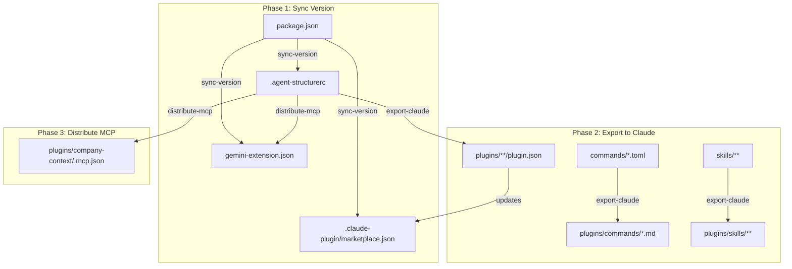

# ai-team

Repository with AI tooling for teams — Gemini CLI extensions and Claude Code marketplace plugins.

## Gemini CLI

### Installation

```bash
gemini extensions install https://github.com/dezkareid/ai-team
```

## Claude Code

### Install the marketplace

Add this marketplace to Claude Code so it can discover the available plugins:

```bash
claude marketplace add dezkareid-ai-team https://github.com/dezkareid/ai-team
```

### Available plugins

#### `npm-tools` — Tools for working with npm

| Command | Description |
|---|---|
| `npm-package-setup` | Initialize and publish a new npm package. |
| `npm-publish` | Setup NPM publication workflow with OIDC and provenance using local standard actions (Monorepo & pnpm support). |

#### `design-system` — Authoritative design system context and tools

| Skill | Description |
|---|---|
| `design-tokens` | Authoritative context for the project's design tokens. Provides information on colors, spacing, and breakpoints using CSS custom properties. |

#### `company-context` — Authoritative company context and tools

### AI Team MCP

The `ai-team` MCP server provides authoritative business and architectural context to AI agents.

#### Available Tools

| Tool | Description |
|---|---|
| `get_enterprise_context` | Retrieves the enterprise mission, strategic goals, and core architecture characteristics. |
| `get_company_outcomes` | Retrieves the high-level business outcomes and key results for the enterprise. |
| `get_architecture_principles` | Retrieves the technology-agnostic architecture principles and quality standards. |
| `search_product` | Searches for a specific product's characteristics and goals. Returns a default profile if not found. |

#### Context Structure

The documentation follows a hierarchical, technology-agnostic structure:

```text
context/
├── enterprise.md              # Mission, goals, and core characteristics
├── outcomes.md                # Shared strategic outcomes (OKRs)
├── architecture-principles.md # Fundamental philosophy and standards
└── products/                  # Product-specific characteristics
    ├── personal-website.md
    ├── collecstory.md
    └── default.md             # Fallback for undocumented products
```

#### `web-quality` — Skills for auditing and optimizing web quality

| Skill | Description |
|---|---|
| `web-quality-audit` | Comprehensive web quality audit covering performance, accessibility, SEO, and best practices. |
| `performance` | Optimize web performance for faster loading and better user experience. |
| `accessibility` | Audit and improve web accessibility following WCAG 2.2 guidelines. |
| `seo` | Optimize for search engine visibility and ranking. |
| `core-web-vitals` | Optimize Core Web Vitals (LCP, INP, CLS) for better page experience and search ranking. |
| `best-practices` | Apply modern web development best practices for security, compatibility, and code quality. |

#### `frontend-tools` — Expert procedural guidance for frontend development

| Skill | Description |
|---|---|
| `react-best-practices` | Expert guidance for React development, including hooks, performance, and patterns. |
| `next-best-practices` | Best practices for Next.js applications, including RSC, caching, and routing. |

#### `database-tools` — Expert procedural guidance for database optimization and best practices

| Skill | Description |
|---|---|
| `supabase-postgres-best-practices` | Postgres performance optimization and best practices from Supabase. |

### Install a plugin

Once the marketplace is added, install a plugin with:

```bash
claude plugin install npm-tools
claude plugin install design-system
claude plugin install company-context
claude plugin install web-quality
claude plugin install frontend-tools
claude plugin install database-tools
```

## Development

### Workflow

The project uses a structured workflow to keep versions, commands, and configurations in sync across Gemini and Claude platforms.



> **Note**: You must run `pnpm run build` before executing these commands, as they rely on the compiled files in the `dist/` directory.

1.  **Sync Version**: Run `pnpm run sync-version` to propagate the version from `package.json` to `.agent-structurerc`, `.claude-plugin/marketplace.json`, and `gemini-extension.json`.
2.  **Export to Claude**: Run `pnpm run export-claude` to process source files and update plugins.
3.  **Distribute MCP**: Run `pnpm run distribute-mcp` to resolve placeholders and update platform-specific MCP configurations.

### Versioning skills and plugins

Skills and plugins follow independent semantic versioning driven by changeset files.

| Artifact | Version location |
|---|---|
| **Skill** | `metadata.version` in the skill's `SKILL.md` frontmatter |
| **Plugin** | `version` under `claude-plugins.<id>` in `.agent-structurerc` |

Create a changeset file in `.changeset/` (use `pnpm changeset` or write it manually):

```md
---
"design-tokens": minor
"npm-tools": patch
---

Brief description of what changed.
```

Then apply the changesets:

```bash
pnpm run build
pnpm run apply-skill-changesets   # bumps version in SKILL.md
pnpm run apply-plugin-changesets  # bumps version in .agent-structurerc
```

After bumping plugin versions, run `pnpm run export-claude` to propagate the new versions to `plugin.json` and `marketplace.json`.

### Organization

- **`commands/`**: Source command files in TOML format (Gemini CLI).
- **`skills/`**: Source skill files (SKILL.md) for specialized AI knowledge.
- **`plugins/`**: Exported Claude Code plugins.
- **`.claude-plugin/`**: Claude marketplace and plugin metadata.

### Testing

Tests are written using **Vitest**:

```bash
pnpm test
```
